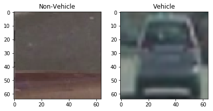
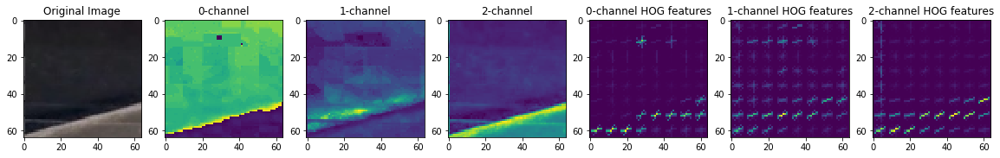
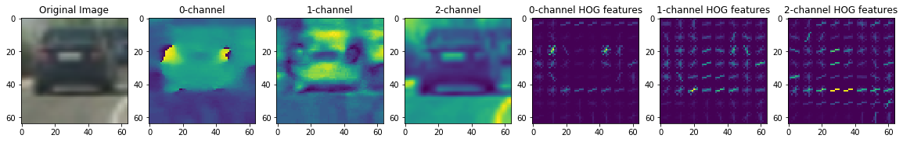
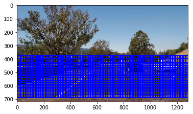

# Vehicle Detection

In this project I've described the steps to detect vehicles in a video. The steps of this project are the following:

* Perform a Histogram of Oriented Gradients (HOG) feature extraction on a labeled training set of images and train a classifier Linear SVM classifier
* Apply a colour transform and append binned colour features, as well as histograms of colour, to your HOG feature vector.
* Implement a sliding-window technique and use your trained classifier to search for vehicles in images.
* Run your pipeline on a video stream (project_video.mp4) and create a heat map of recurring detections frame by frame to reject outliers and follow detected vehicles.
* Estimate a bounding box for vehicles detected.

## Histogram of Oriented Gradients (HOG) feature extraction
I started by reading in all the `vehicle` and `non-vehicle` images that were shared as part of this project. Below an example of one of each of the `non-vehicle` and `vehicle` classes:

When loading the images using matplotlib.image the image will automatically be normalized. I then explored different colour spaces and different parameters (`orientations`, `pixels_per_cell`, and `cells_per_block`). Here is an example using the `HSV` colour space and HOG parameters of `orientations=9`, `pixels_per_cell=(8, 8)` and `cells_per_block=(2, 2)` of one of each of the `non-vehicle` and `vehicle` classes:

The code for reading the image and extracting the HOG features can be found in the notebook 'Vehicle tracking pipeline' in the 2nd and 3rd code block respectively. These steps are also made visually in the same notebook.

### HSV
There are multiple options of colour spaces to extract HOG features: RGB, HSV, LUV, HLS, YUV, and YCrCb. Ideally, one could use all colour spaces. However, this makes our features set unnecessary big and slows down the inference speed of our pipeline. To determine the optimal colour space, I've tried all 6 colour spaces (with the same parameters) before feeding the images to my default SVM classifier discussed below. HSV showed the best results with an accuracy of 0.9601. The HSV colour space if used for all other feature extractors described below.

Note: maybe another classifier in combination with other parameters or other classifiers would have resulted in a higher test accuracy.

In the images above you can see that I've used all three channels of the HSV colour space. The V channel seems to map the car's shape the best. But the other channels also show some indicators for the car's shape. 
To extract the HOG features, I've used the build in function in skimage (see function 'get_hog_features'). 

### Parameters
The final paramters are based on emperical results. I've tried multiple combinations of parameters. Ideally, I would have used a baysian parameter search or a grid search to test all different combinations including colour spaces. 

The best result obtained so far was using 9 orientations, 8 pixel per cell, and 2 cell per blocks.

## Binned colour features and histograms of colours
I also use spatial and histogram of colours features for training my classifier. 

Colour could make an object stand out against the background. Cars often have different colours than the background (background is generally pale). In the HSV colour space this can clearly be seen using the S-channel (saturation): the colour itself or hue might be less of an indicator, but the car often does have a more prominent apperance. However, I've added the histogram of all 3-channels (with the custom function 'color_hist' and bin size 32) to my final feature set to make sure I don't miss some of the detailed features as well.

By binning the colours, I've downsized (using 'cv2.resize') the number of features, but some important identifiable (by eye) features are still visible. So this means this adds relevant features without adding too many features. I didn't explore te option to downsize the images more than 32x32, but this might reduce the number of binned colour features even more without performance loss.

## Classifier
To summarise all data used for training the classifier: HOG features, binned colour features, and histogram of colours. This brings the total feature set to 17,772 per image. To prevent from one feature standing out from another, I've standardised all features per column (zero mean and unit variance) using the StandardScaler from sklearn. 

The provided data is used (vehicles and non-vehicles) to train the classifier. To test the accuracy and prevent overfitting I've splitted the data in a training set and test set, where the test set is 20% of the total available data. At the same time the data is randomly shuffled. 

I trained a SVM with linear kernel using the SVC implementation in scikit learn (with all default paramters). This model showed a test accuracy of 0.9907.

## Sliding-window technique
To detect car in our image, I've used a sliding window technique. The code can be found in the 7th code block of the notebook 'Vehicle tracking pipeline'. 

To use our classifier we first need to localise the potential cars. The car can be of different sizes (depending on the distance) and in different positions across the images. A sliding window, loops through the image and create different windows with .

Such a window can have different sizes and potentially we should overlap these windows, because otherwise there is a hard cut where the car should fit in each window (where in our training data the car was centralised). I've chosen to use a fixed window size of 64x64. This represents the average car size that is closeby and some tested shows that even bigger and smaller cars can be detected with this window size. 
In an ideal case we would have made our window size dynamic. Smaller for cars further away (higher in the image) and bigger for cars closeby (lower part of the image).

For the overlap we decided to go for 0.6 in both directions. We didn't see much improvement for larger overlap, but adding more overlap increased the inference time a lot (I experimented with values between 0.5 x 0.8). The higher the overlap the more compute expensive the algorithms is. For example, 312 windows for an overlap of 0.5 and 2568 windows for an overlap of 0.8. The extra training time didn't result in much improvement.

My final sliding window functionsearches the bottom half of the image: I only use x-values between 375 and 675, because the top only represents the sky and some background and the bottom the front of the car. See example below.

These images captured by the sliding windows function are resized before feeding into the classifier.

To keep track of the results, I've plotted the results on the test image after each iteration (see images below). Playing around with the hyperparamters and a custom threshold for the heatmap, I've visually detected improvements on the test images. When happy with the (intermediary) results, the results were also visually tested on the video.

## Video pipeline
To make my algorithm more robust for videos I've added some techniques to detect vehicles in subsequent frames. A heatmap (the code can be found in the 9th and 11th code block of the notebook 'Vehicle tracking pipeline' in the functions get_hot_windows and detect_vehicles respectively) is added to show the location of repeated vehicle detections. The previous results are stored in a custom class Memory, that stores values of the previous frame. This is used to reduce the number of false positives. 

To combine multiple overlapping boundig boxes I've added a function (draw_labeled_bboxes, found in the 12th code block) that combines all bounding boxes. The overlapping bounding boxes are extended to the min and max values so that a bigger bounding box is created.

## Output video
To process the video, I've created a function process_image. The output video can be downloaded from [here](output_video.mp4).

## Discussion
The current pipeline will probably show worse performance in other situations like darkness, rain, and fog. A more robust (ensemble of) model(s) can help. Another option, is to add other data sources that can help with detection, For example, lidar data to detect cars. Also, there are still multiple frames in the video where my pipeline did not detect a car or were false positives are detected (false postives can result in dangurous situations like braking or lane changing).

I've already tried to optimise the speed of my pipeline, because in a real-world scenario real-time detection is needed. For example, I've limited the search space of the image and limited the overlap between the windows. Morover, we didn't even train for other obstacles like pedestrians, trucks, road blocks, etc. This would limit the speed of our algorithm even more. I believe that other deep learning approaches, like SSD and YOLO could overcome this. 

The SVM classifier used for classifying vehicles vs non-vehicles showed an test accuracy of 0.9907. This already proved to be an high accuracy for the problem we are trying to solve. Ideally the classifier alone should predict with even higher accuracy (also for different situations described above). I need to say that my pipeline had a harder time to classify the white car in the test video. It could be that the car does not stand out as well as the dark car. Also important is that the inference time of the classifier is short (ideally the classifier self should be able to predict in real-time). Some suggestions to improve the current used classifier:
* Try other algorithms
* Use an ensemble of methods (will increase accuracy, but at the same time also the time complexity)
* Add more training data or create augmentations of training data to make the model more robust
* Add penalty to FP predictions (e.g. changing thresholds)
* Fine tune parameters
